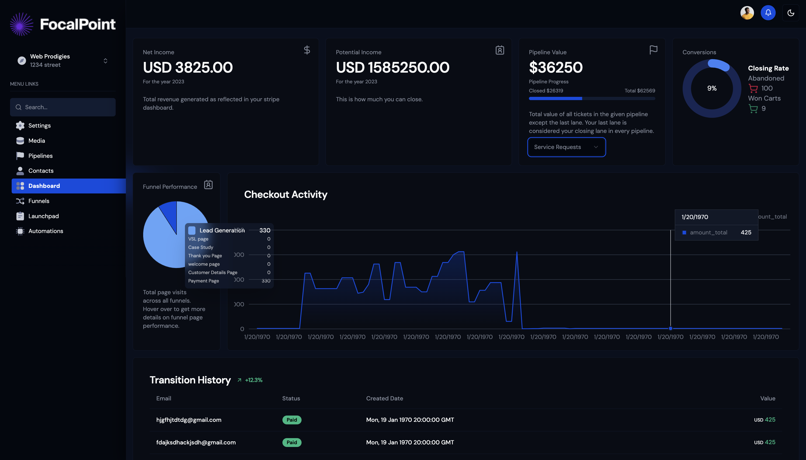

# SaaS Website Builder, Project Management, and Dashboard

This project is a comprehensive SaaS application designed to streamline website building, project management, and dashboard functionalities for businesses and freelancers. Built with modern technologies including Next.js 14, Bun, Stripe Connect, Prisma, and MySQL, this platform supports a variety of features from role-based access to real-time analytics.

## Features

- **Multivendor B2B2B SaaS Platform:** Enables businesses to create, manage, and scale their operations seamlessly.
- **Agency and Sub-Accounts:** Manage multiple client accounts with sub-account functionalities.
- **Unlimited Funnel Hosting:** Host and manage marketing funnels without limitations.
- **Full Website & Funnel Builder:** Drag-and-drop interfaces to build custom websites and funnels.
- **Role-Based Access Control:** Securely manage who has access to different parts of the application.
- **Stripe Integration:**
  - **Stripe Subscription Plans:** Easily manage subscription billing.
  - **Stripe Add-On Products:** Integrate additional purchasable features.
  - **Stripe Connect:** Facilitate payments for users with integrated Stripe accounts.
  - **Custom Dashboards:** Tailored analytics and reporting dashboards for different user roles.
- **Project Management System:** Includes a Kanban board for task management and project tracking.
- **Real-Time Analytics:** Track funnel performance, agency metrics, and more with live data.
- **Media Storage and Sync:** Store and synchronize digital assets across the platform.
- **Dual Theme Interface:** Switch between light and dark modes for user preference.

## Getting Started

### Prerequisites

- Node.js
- Bun
- MySQL
- Stripe account

### Installation

1. Clone the repository:
   ```bash
   git clone https://yourgithubrepo.com/yourproject.git
